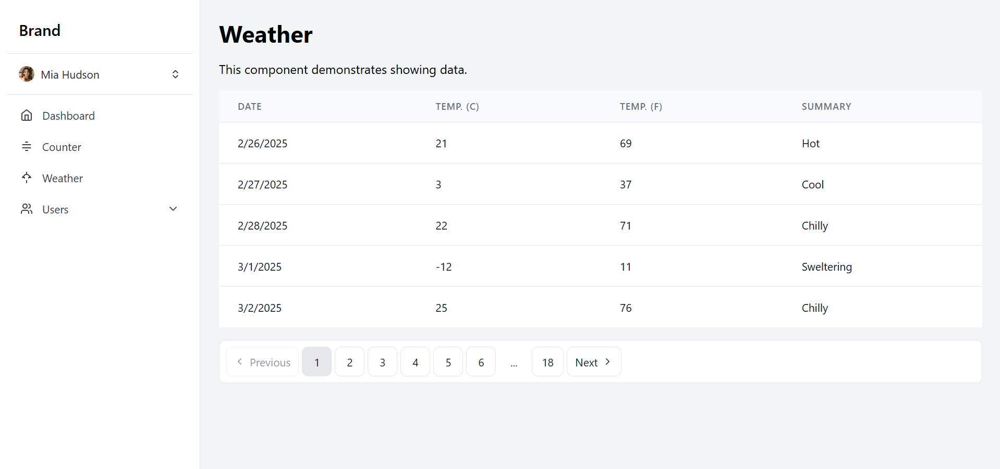

# How to Install Preline UI and Tailwind CSS in a Blazor .NET 8 Project

This guide will walk you through the steps to install and configure **Preline UI** and **Tailwind CSS** in a **Blazor .NET 8** project. By the end of this guide, you'll have a fully functional Blazor application with Preline UI components and Tailwind CSS styling.

---




## Prerequisites

Before you begin, ensure you have the following installed:

- [.NET 8 SDK](https://dotnet.microsoft.com/download/dotnet/8.0)
- [Node.js](https://nodejs.org/) (for npm commands)
- A code editor like [Visual Studio](https://visualstudio.microsoft.com/) or [VS Code](https://code.visualstudio.com/)

---

## Step 1: Create a New Blazor Project

1. Open a terminal or command prompt.
2. Run the following command to create a new Blazor project:

   ```bash
   dotnet new blazor -n MyBlazorApp
   ```

3. Navigate to the project directory:

   ```bash
   cd MyBlazorApp
   ```

---

## Step 2: Install Tailwind CSS

1. Initialize a `package.json` file (if it doesn't already exist):

   ```bash
   npm init -y
   ```

2. Install Tailwind CSS and its dependencies:

   ```bash
   npm install -D tailwindcss@3 postcss autoprefixer
   ```

3. Generate the `tailwind.config.js` file:

   ```bash
   npx tailwindcss init
   ```

4. Open the `tailwind.config.js` file and configure it to include your Blazor files:

   ```javascript
   /** @type {import('tailwindcss').Config} */
   module.exports = {
     content: [
       "./**/*.razor",
       "./**/*.html",
       "./**/*.cshtml",
     ],
     darkMode: 'class', // Add this line for default disabled dark mode
     theme: {
       extend: {},
     },
     plugins: [],
   }
   ```

5. Add the following Tailwind directives to the `wwwroot/css/site.css` file:

   ```css
   @tailwind base;
   @tailwind components;
   @tailwind utilities;
   ```

6. Add a script to your `package.json` to build Tailwind CSS:

   ```json
   "scripts": {
     "build:css": "tailwindcss -i ./wwwroot/css/site.css -o ./wwwroot/css/output.css --minify"
   }
   ```

7. Run the script to generate the Tailwind CSS file:

   ```bash
   npm run build:css
   ```

8. Link the generated CSS file in your `_Host.cshtml` or `App.razor` (for Blazor Server) or `index.html` (for Blazor WebAssembly):

   ```html
   <link href="css/output.css" rel="stylesheet" />
   ```

---

## Step 3: Install Preline UI

1. Install Preline UI via npm:

   ```bash
   npm install preline
   ```

2. Add Preline's JavaScript to your `_Host.cshtml` or `App.razor` (for Blazor Server) or `index.html` (for Blazor WebAssembly):

   ```html
   <script src="../node_modules/preline/dist/preline.js"></script>
   ```

3. Initialize Preline UI in your Blazor component or `_Host.cshtml` or `App.razor`:

   ```html
   <script>
     window.initializePreline = () => {
       window.HSStaticMethods.autoInit();
     };
   </script>
   ```

4. Call the initialization in `MainLayout.razor`:

   ```csharp
   @code {
     protected override async Task OnAfterRenderAsync(bool firstRender) {
       if (firstRender) {
         await JSRuntime.InvokeVoidAsync("initializePreline");
       }
     }
   }
   ```

5. **Use a Static File Provider**

   Add a static file provider to serve files from the `node_modules` directory:

   ```csharp
   app.UseHttpsRedirection();

   app.UseStaticFiles();
   app.UseAntiforgery();

   // Serve static files from node_modules
   var nodeModulesPath = Path.Combine(builder.Environment.ContentRootPath, "node_modules");
   app.UseStaticFiles(new StaticFileOptions
   {
       FileProvider = new PhysicalFileProvider(nodeModulesPath),
       RequestPath = "/node_modules"
   });

   app.MapRazorComponents<App>()
       .AddInteractiveServerRenderMode();

   app.Run();
   ```

---

## Step 4: Automate Tailwind CSS Builds

To automatically rebuild Tailwind CSS when your project changes, add the following script to your `package.json`:

```json
"scripts": {
  "watch:css": "tailwindcss -i ./wwwroot/css/site.css -o ./wwwroot/css/output.css --watch"
}
```

Run the script in a separate terminal:

```bash
npm run watch:css
```

---

## Conclusion

You've successfully installed and configured **Preline UI** and **Tailwind CSS** in your Blazor .NET 8 project! You can now use Preline's prebuilt components and Tailwind's utility classes to build beautiful and responsive Blazor applications.

For more information, check out the official documentation:

- [Tailwind CSS](https://tailwindcss.com/docs)
- [Preline UI](https://preline.co/docs)

Happy coding! 🚀